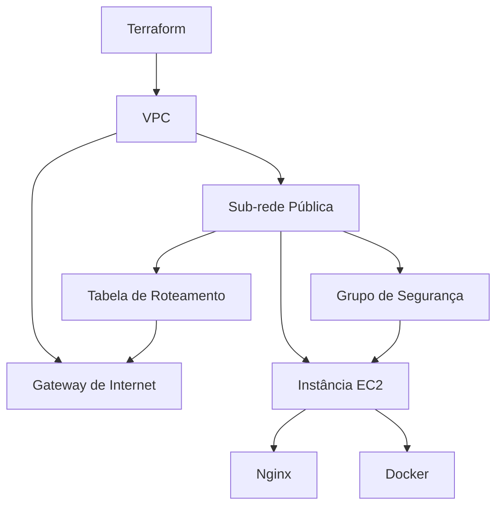

### README.md

# Terraform Nginx Deployment

Este projeto usa Terraform para configurar e implantar um servidor Nginx em uma instância EC2 na AWS. Ele cria toda a infraestrutura necessária, incluindo uma VPC, sub-rede pública, gateway de internet, tabela de roteamento, grupo de segurança e a instância EC2.

## Requisitos

- Conta na AWS
- Terraform instalado
- Chave SSH configurada para acessar a instância EC2

## Arquivos do Projeto

- `main.tf`: Configuração principal do Terraform.
- `vpc.tf`: Configuração da VPC, sub-rede pública, gateway de internet e tabela de roteamento.
- `security_group.tf`: Configuração do grupo de segurança.
- `ec2.tf`: Configuração da instância EC2 e script de inicialização.

## Por que precisamos de uma VPC?

Uma VPC (Virtual Private Cloud) é uma rede virtual dedicada à sua conta AWS. Ela permite que você isole e controle completamente o ambiente de rede de suas instâncias EC2. Pense na VPC como uma casa com várias salas (sub-redes), onde você pode controlar quem entra e quem sai, garantindo que seus recursos estejam seguros e bem organizados.

## Por que precisamos de um Grupo de Segurança?

O grupo de segurança funciona como uma "parede de segurança" ao redor da sua instância EC2. Ele define as regras de entrada e saída para controlar o tráfego de rede. Sem um grupo de segurança, sua instância estaria vulnerável a acessos indesejados. No nosso projeto, configuramos o grupo de segurança para permitir o acesso HTTP (porta 80) para o servidor Nginx.

## Estrutura do Projeto

Este projeto utiliza Terraform para configurar uma infraestrutura na AWS, incluindo uma VPC, uma sub-rede pública, um gateway de internet, um grupo de segurança e uma instância EC2. Na instância EC2, o Docker é instalado e utilizado para executar um contêiner Nginx, que serve como servidor web.




## Descrição dos Arquivos

Descrição dos Arquivos
README.md: Documentação do projeto, explicando como configurar e implantar a aplicação Nginx em uma instância EC2 com Docker.

main.tf: Arquivo principal do Terraform que contém a configuração do provedor AWS e as definições principais.

vpc.tf: Contém a configuração da Virtual Private Cloud (VPC), incluindo sub-redes, gateways de internet e rotas.

security_group.tf: Define as regras do grupo de segurança, controlando o tráfego de entrada e saída para a instância EC2.

ec2.tf: Configura a instância EC2 e inclui o script de inicialização que instala o Docker e inicia o Nginx.

## Passos para Implantação

Clone o Repositório:

```sh
git clone https://github.com/isabelaleeite/vexpenses-projeto-devops.git
cd vexpenses-projeto-devops
```

Inicialize o Terraform:

```sh
terraform init
```

Planeje a Infraestrutura:

```sh
terraform plan
```

Aplique a Configuração:

```sh
terraform apply
```

Acesse o Servidor Nginx:

Use o endereço IP público exibido no output do Terraform para acessar o servidor Nginx no navegador:

```arduino
http://<instance_public_ip>
```
