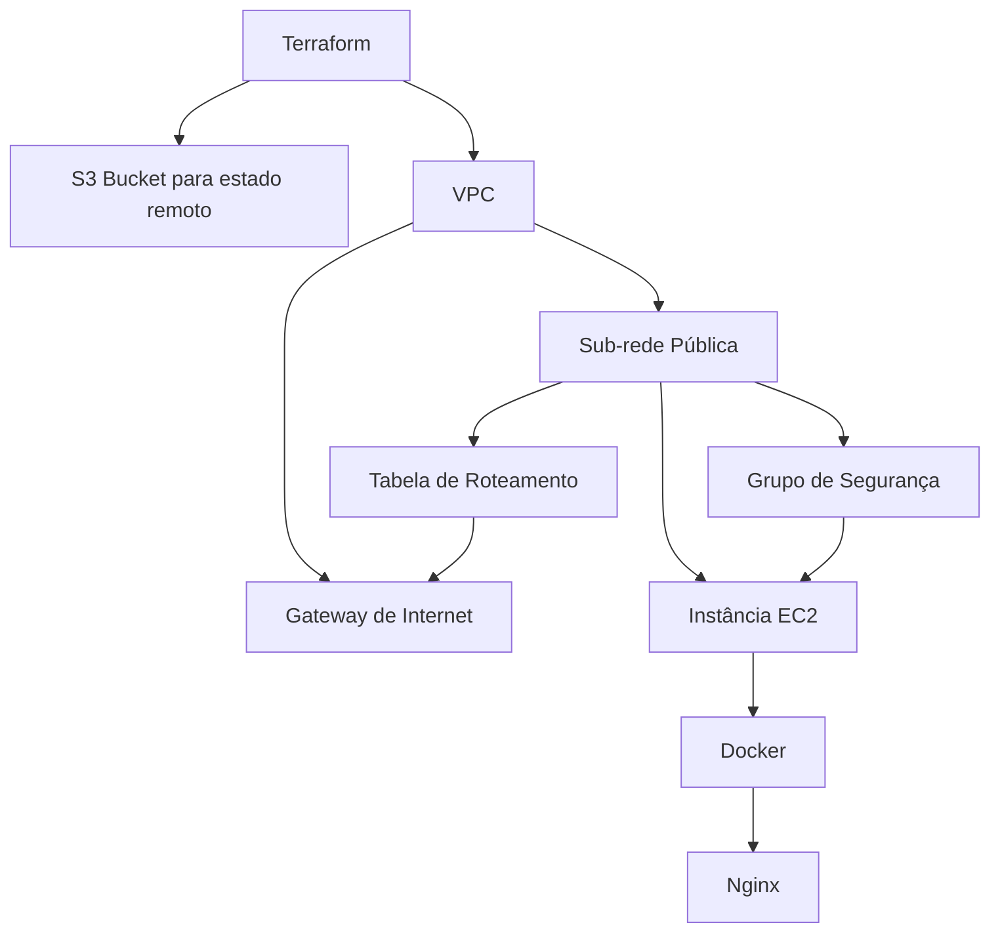

### README.md

# Desafio Terraform VExpenses

Este projeto usa Terraform para configurar e implantar um servidor Nginx em uma instância EC2 na AWS. Além de criar a infraestrutura necessária, ele também configura um bucket S3 para armazenar o estado do Terraform. A infraestrutura criada inclui uma VPC, sub-rede pública, gateway de internet, tabela de roteamento, grupo de segurança, instância EC2, e o Nginx é executado em um contêiner Docker dentro da EC2.

## Requisitos

- Conta na AWS
- Terraform instalado
- Chave SSH configurada para acessar a instância EC2

## Arquivos do Projeto

- `s3_bucket.tf`: Configuração do bucket S3 onde o estado do Terraform será armazenado.
- `main.tf`: Configuração principal do Terraform.
- `vpc.tf`: Configuração da VPC, sub-rede pública, gateway de internet e tabela de roteamento.
- `security_group.tf`: Define regras de segurança que controlam o tráfego de entrada e saída da instância EC2, permitindo apenas o tráfego autorizado, como o acesso via SSH e HTTP, enquanto bloqueia conexões não permitidas para proteger a instância.
- `ec2.tf`: Configura a instância EC2, utilizando o par de chaves e executando um script de inicialização que instala o Docker e executa o Nginx em um contêiner Docker.

## Estrutura do Projeto




## Descrição dos Arquivos

**README.md**

Documentação do projeto, explicando como configurar e implantar a aplicação Nginx em uma instância EC2 com Docker. O arquivo também orienta sobre a criação do bucket S3 para armazenar o estado remoto do Terraform.

**Diretório 00-remote-state-bucket:**

`s3_bucket.tf`: Arquivo que define a criação do bucket S3 na AWS, utilizado para armazenar o estado remoto do Terraform. Este arquivo deve ser executado antes da configuração da infraestrutura principal.

**Diretório 01-terraform:**

`main.tf`: Arquivo principal do Terraform que configura o provedor AWS e referencia o bucket S3 para armazenar o estado remoto do Terraform.

`vpc.tf`: Configuração da Virtual Private Cloud (VPC), incluindo a criação de sub-redes, gateway de internet e tabela de roteamento.

`security_group.tf`: Define as regras do grupo de segurança, controlando o tráfego de entrada e saída da instância EC2.

`ec2.tf`: Configura a instância EC2, especificando o script de inicialização que instala o Docker e inicia o Nginx dentro de um contêiner Docker.


## Passos para Implantação

1. **Clone o Repositório:**

```bash
git clone https://github.com/isabelaleeite/vexpenses-projeto-devops.git
cd vexpenses-projeto-devops
```

2. **Crie o Bucket S3 para o Remote State:**

Entre na pasta onde o arquivo de configuração do bucket S3 está localizado:

```bash
cd 00-remote-state-bucket
```

3. **Inicialize o Terraform para o bucket S3:**

```bash
terraform init
```

4. **Aplique a configuração para criar o bucket S3:**

```bash
terraform apply
```
5. **Depois que o bucket S3 for criado, retorne à pasta principal:**

```bash
cd ..
```

6. **Inicialize a Configuração Principal:**

Navegue até a pasta principal do Terraform:

```bash
cd 01-terraform
```

7. **Inicialize o Terraform:**

```bash
terraform init
```

8. **Planeje a Infraestrutura:**

Verifique o plano de infraestrutura que será criado:

```bash
terraform plan
```

9. **Aplique a Configuração:**

Aplique a configuração para provisionar os recursos:

```bash
terraform apply
```

10. **Acesse o Servidor Nginx:**

Use o endereço IP público exibido no output do Terraform para acessar o servidor Nginx no navegador:

```bash
http://<instance_public_ip>
```

## Arquivos de Configuração

### `s3_bucket.tf`

```hcl
provider "aws" {
  region = "us-east-1"
}

# Criação do bucket S3 para o backend
resource "aws_s3_bucket" "state_bucket" {
  bucket = "vexpenses-isabela-leite-state-bucket"  # Nome fixo para o bucket

  tags = {
    Name = "vexpenses-isabela-leite-state-bucket"  # Nome fixo para as tags
  }

  force_destroy = true  # Para que o bucket seja excluído mesmo se possuir objetos
}

# Habilitar o versionamento do bucket
resource "aws_s3_bucket_versioning" "state_bucket_versioning" {
  bucket = aws_s3_bucket.state_bucket.id

  versioning_configuration {
    status = "Enabled"  
  }
}
```

### `main.tf`

```hcl
provider "aws" {
  region = "us-east-1"
}

variable "projeto" {
  description = "Nome do projeto"
  type        = string
  default     = "VExpenses"
}

variable "candidato" {
  description = "Nome do candidato"
  type        = string
  default     = "IsabelaLeite"
}

terraform {
  backend "s3" {
    bucket  = "vexpenses-isabela-leite-state-bucket"
    key     = "terraform.tfstate"
    region  = "us-east-1"
    encrypt = true
  }
}

# Geração de chave privada
resource "tls_private_key" "ec2_key" {
  algorithm = "RSA"
  rsa_bits  = 2048
}

# Par de chaves para a instância EC2
resource "aws_key_pair" "ec2_key_pair" {
  key_name   = "${var.projeto}-${var.candidato}-key"
  public_key = tls_private_key.ec2_key.public_key_openssh
}
```

### `ec2.tf`

```hcl
# Obtendo a versão mais recente do Debian 12
data "aws_ami" "debian12" {
  most_recent = true

  filter {
    name   = "name"
    values = ["debian-12-amd64-*"]
  }

  filter {
    name   = "virtualization-type"
    values = ["hvm"]
  }

  owners = ["679593333241"]
}

# Instância EC2 Debian
resource "aws_instance" "debian_ec2" {
  ami             = data.aws_ami.debian12.id
  instance_type   = "t2.micro"
  subnet_id       = aws_subnet.main_subnet.id
  key_name        = aws_key_pair.ec2_key_pair.key_name
  security_groups = [aws_security_group.main_sg.id]

  associate_public_ip_address = true

  root_block_device {
    volume_size           = 20
    volume_type           = "gp2"
    delete_on_termination = true
  }

 # Script de inicialização
   user_data = <<-EOF
              #!/bin/bash
              sudo apt-get update -y
              sudo apt-get install -y docker.io
              sudo systemctl start docker
              sudo systemctl enable docker
              sudo docker run -d -p 80:80 --name nginx-server nginx
              EOF

  tags = {
    Name = "${var.projeto}-${var.candidato}-ec2"
  }
}

# Outputs sensíveis
output "private_key" {
  description = "Chave privada para acessar a instância EC2"
  value       = tls_private_key.ec2_key.private_key_pem
  sensitive   = true
}

output "ec2_public_ip" {
  description = "Endereço IP público da instância EC2"
  value       = aws_instance.debian_ec2.public_ip
}
```
### `security_group.tf`

```hcl
# Grupo de segurança para a instância EC2
resource "aws_security_group" "main_sg" {
  name        = "${var.projeto}-${var.candidato}-sg"
  description = "Permitir SSH de qualquer lugar e todo o trafego de saida"
  vpc_id      = aws_vpc.main_vpc.id

  # Regras de entrada - SSH de qualquer lugar (porta 22)

  ingress {
    description      = "Permitir SSH de qualquer lugar"
    from_port        = 22
    to_port          = 22
    protocol         = "tcp"
    cidr_blocks      = ["0.0.0.0/0"]
    ipv6_cidr_blocks = ["::/0"]
  }


   # Permitir acesso HTTP para Nginx (porta 80)

  ingress {
    from_port   = 80
    to_port     = 80
    protocol    = "tcp"
    cidr_blocks = ["0.0.0.0/0"]
  }

  # Regras de saída - Permitir todo o tráfego de saída
  egress {
    description      = "Permitir todo o trafego de saida"
    from_port        = 0
    to_port          = 0
    protocol         = "-1"
    cidr_blocks      = ["0.0.0.0/0"]
    ipv6_cidr_blocks = ["::/0"]
  }

  tags = {
    Name = "${var.projeto}-${var.candidato}-sg"
  }
}
```
### `vpc.tf`

 ```hcl
 # Criação da VPC pública
resource "aws_vpc" "main_vpc" {
  cidr_block           = "10.0.0.0/16"
  enable_dns_support   = true
  enable_dns_hostnames = true

  tags = {
    Name = "${var.projeto}-${var.candidato}-vpc"
  }

}

# Criação da Subnet pública na VPC 
resource "aws_subnet" "main_subnet" {
  vpc_id            = aws_vpc.main_vpc.id
  cidr_block        = "10.0.1.0/24"
  availability_zone = "us-east-1a"

  tags = {
    Name = "${var.projeto}-${var.candidato}-subnet"
  }
}

# Gateway do Internet Gateway

resource "aws_internet_gateway" "main_igw" {
  vpc_id = aws_vpc.main_vpc.id

  tags = {
    Name = "${var.projeto}-${var.candidato}-igw"
  }
}

# Criação da Tabela de Roteamento

resource "aws_route_table" "main_route_table" {
  vpc_id = aws_vpc.main_vpc.id

  route {
    cidr_block = "0.0.0.0/0"
    gateway_id = aws_internet_gateway.main_igw.id
  }

  tags = {
    Name = "${var.projeto}-${var.candidato}-route_table"
  }
}

# Associação da tabela de rotas com a subnet
resource "aws_route_table_association" "main_association" {
  subnet_id      = aws_subnet.main_subnet.id
  route_table_id = aws_route_table.main_route_table.id

}
```
## Aplicação de Melhorias

1. ### Divisão do Código em Múltiplos Arquivos

Organizei os recursos em diferentes arquivos (s3_bucket.tf, main.tf, ec2.tf, security_group.tf, vpc.tf). Essa modularização melhora a legibilidade e a manutenção do código, permitindo que as configurações de diferentes recursos sejam isoladas e facilitando tanto a compreensão quanto alterações futuras.

2. ### Configuração do Backend S3 e Versionamento do Estado

Implementei o uso de um bucket S3 para armazenar o estado do Terraform de forma segura, com versionamento e criptografia:

hcl
resource "aws_s3_bucket" "state_bucket" {
  bucket = "vexpenses-isabela-leite-state-bucket"
  force_destroy = true
}

resource "aws_s3_bucket_versioning" "state_bucket_versioning" {
  bucket = aws_s3_bucket.state_bucket.id
  versioning_configuration {
    status = "Enabled"
  }
}

terraform {
  backend "s3" {
    bucket  = "vexpenses-isabela-leite-state-bucket"
    key     = "terraform.tfstate"
    region  = "us-east-1"
    encrypt = true
  }
}

Essa modificação cria um bucket S3 dedicado para armazenar o estado do Terraform de forma centralizada e segura. O versionamento permite que um histórico das versões do estado seja mantido, facilitando a recuperação em caso de problemas, e a criptografia garante a proteção das informações sensíveis.

3. ### Atualização do Script de Inicialização na EC2 (ec2.tf)

Modifiquei o script de inicialização para instalar e configurar o Docker, além de iniciar um contêiner Nginx:

```bash
user_data = <<-EOF
  #!/bin/bash
  sudo apt-get update -y
  sudo apt-get install -y docker.io
  sudo systemctl start docker
  sudo systemctl enable docker
  sudo docker run -d -p 80:80 --name nginx-server nginx
EOF
```

Essa modificação automatiza o provisionamento de um servidor Nginx em um contêiner Docker, configurando a instância EC2 para servir aplicações web de forma automática e padronizada.

4. ### Modificação no Grupo de Segurança (security_group.tf)

Adicionei uma regra para permitir tráfego HTTP (porta 80):

```hcl
ingress {
  from_port   = 80
  to_port     = 80
  protocol    = "tcp"
  cidr_blocks = ["0.0.0.0/0"]
}
```
Essa alteração permite que o servidor Nginx, rodando no contêiner, seja acessível publicamente pela porta 80. Ela é essencial para habilitar o acesso ao serviço web configurado. No entanto, reconheço que essa configuração poderia ser ajustada para restringir o acesso a uma faixa específica de IPs, caso seja necessário aumentar a segurança.

5. ### Atualização das Variáveis (main.tf)

Atualizei as variáveis projeto e candidato para refletirem o nome do projeto e o meu nome, deixando mais claro que os recursos pertencem a mim:

```hcl
variable "candidato" {
  default = "IsabelaLeite"
}
```

Isso facilita a identificação e o gerenciamento dos recursos, personalizando o ambiente de acordo com o meu contexto e o do projeto.


## Conclusão

Este projeto demonstra como usar Terraform para configurar uma infraestrutura na AWS, criar um bucket S3 para armazenar o estado do Terraform e implantar o Nginx em uma instância EC2 utilizando Docker. A infraestrutura automatizada inclui a criação de uma VPC, sub-rede, grupo de segurança, bucket S3 para o armazenamento remoto do estado, e uma instância EC2. O Nginx é iniciado dentro de um contêiner Docker, permitindo fácil implementação e escalabilidade.